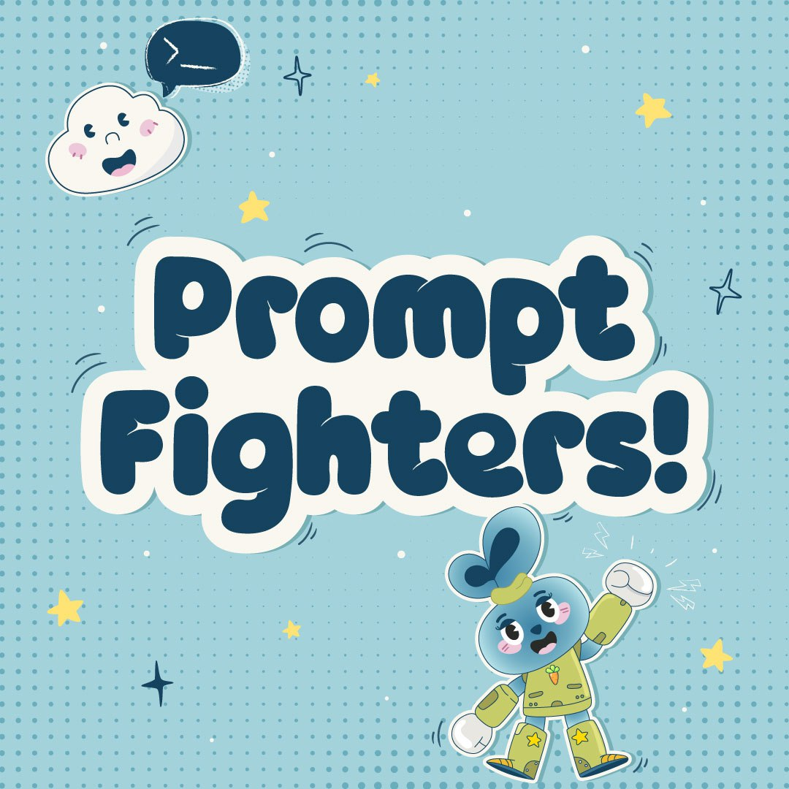
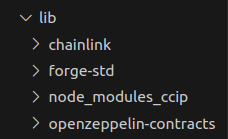

# PROMPT FIGHTERS❗❗❗🤯

<p align="center">
  
</p>

Do you remember when you were a kid and you were using your toys to **_`create legendary fights`_**?

Have you ever thought on **`betting and earning real money on`** fair **_`imagination battles`_** with your friends?

**`Are you too busy`** to play with your imagination like when you were a kid but **`you wish you had the time`** for it?

Well say no more, we present... **_`PROMPT FIGHTERS`_** ❗

---

### `VIDEO PRESENTATION` 📹

Click on the image to watch the video on **`Youtube`**.

<a href="https://www.youtube.com/watch?v=NpHMpbXRhPA" target="_blank"></a>

---

## Quick view on technlogies code for judges 🧑‍⚖️👩‍⚖️

#### (we recommend to read this entire README though :D)

Technologies implemented here, links go directly to code line on files:

- **`Chainlink Functions`**: [eth-PromptFighters.sol](./src/backend/contracts/nft-contracts/eth-PromptFightersNft.sol#L181), [FightExecutor.sol](./src/backend/contracts/fight-contracts/FightExecutor.sol#L114)
- **`Chainlink CCIP`**: [CcipNftBridge.sol](./src/backend/contracts/CcipNftBridge.sol#L97)
- **`Chainlink Automation`**: [FightMatchmaker.sol](./src/backend/contracts/fight-contracts/FightMatchmaker.sol#L321)
- **`Chainlink VRF`**: [FightExecutor.sol](./src/backend/contracts/fight-contracts/FightExecutor.sol#L161)
- **`The Graph`**: [Subgraph](./src/subgraph/)
- **`AI related`**: [mintFighter.js](./src/backend/script/chainlinkFunctionsScripts/mintFigther.js#L56), [fightings.js](./src/backend/script/chainlinkFunctionsScripts/figthings.js#L43), [validateNftPrompt](./src/prompts/nft-generation.txt), [fightGenerationPrompt](./src/prompts/fight-generation.txt)

<details> <summary> What each technology brings to the table 🧑‍💻 🆕 </summary>

#### Read technical details and see architecture diagrams at [docs](./docs).

#### **_`Tech's Utility`_**

- **Chainlink VRF**: deciding fair winners
- **Chainlink CCIP**: automating process in cheaper chains. (**_Like Avalanche_**)
- **Chainlink Functions**: Calling APIs to generate NFTs and make them fight in amazing scenarios.
- **Chainlink Automation** (up-keeps): Automating the fight process for those who have no time to play but some time in the night to read the amazing fight stories before sleep.
- **OpenAI - APIs**: To generate interesting fight stories and NFT images.
- **The Graph Indexer**: for cheaper, faster matchmaking and events tracking in website.

#### Check the full-stack source code at [src](./src)

</details>

---

## `A Message for Chainlink` 💌

During our project's development, we detected and thought of potential enhancements and problems using Chainlink Services, particularly Chainlink Functions and Chainlink CCIP.

<details> <summary> 💌 </summary>

#### Key Features for Consideration:

1. Library support in Deno files, especially for hashing (notably keccak256) and asymmetric encryption (ECDSA). Additionally, the addition of a library that simplifies the retrieval of logs from previous blocks would have helped a lot in optimizing and scaling the automated matchmaking and fight system while keeping costs low.

   Practical Application:

   - In our project, implementing hashing would enable private, unique NFT prompts. Currently, NFT prompts are public, allowing duplication. Hashing prompts in Function scripts would allow on-chain storage of hashes and off-chain verification of prompt ownership by the DON, improving privacy and reducing NFT creation costs.

2. Allow for longer HTTP-API calls. AIs that generate images or a bit long outputs like stories take more than the current limit of 9s. Thus we had to mock in Funtions a response simulating an actual AI-API call. Regardless of this the code that would be used if this restriction didn't exist is added in the project.

3. A tool for simulating DONs reponses in local with forked Chainlink contracts would be very helpful for easier debugging and testing.
   We don't know if this tool already exists, but we think it would be very useful. Whether an SDK or a UI app on chainlink's website.

#### Challenges and errors encountered:

With **_`CCIP`_**:

1. Difficulty integrating CCIP with `forge`-based projects.
2. Variable clash (`i_router`) when using Functions and CCIP concurrently.
3. Non-virtual `supportsInterface()` function in `CCIPReceiver.sol`, creating inheritance conflicts in contrats that inherit different contracts using the EIP-165. (e.g., [eth-PromptFightersNFT.sol](./src/backend/contracts/nft-contracts/eth-PromptFightersNft.sol#L271)). Also `supportsInterface()` is defined as `pure` and when mixed with other `supportsInterface()`
   functions like ERC721 OpenZeppelin's implementation creates a conflict as OZ's one is `view`.

With **`Automation`**:

1. We have automation coded in our project but it is only working if upkeep is registered via UI. We don't know whats wrong with our registration code everything looks fine. It's a weird error explained in [this file on scripts directory.](./src/backend/script/AutomationIssue.md).

> 📘**Note**ℹ️: The whole team met in the **SmartCon 2023**, thanks for the great event and the chairs! 😄

</details>

---

---

## `Deep dive details` 💻

<details> <summary> Mechanics 📜 </summary>

#### Read the details of all mechanics, future scenarios, and its reason why at [whitepaper](./docs/whitepaper.md).

#### **_`Mechanics Implemented`_**

- **Personalized NFTs** : describe your NFT as you want over a template.
- **NFT creation AI filtered** : so there are no too powerful or copyright infringement prompts.
- **Fight and bet against other NFTs**.
- **Automated Fighting** : send some funds and enjoy the fight automation.

</details>

---

---

## `USING THE FINAL DEPLOYED CONTRACTS` 🌐-⚙️

<details> <summary> Local set-up ⚙️ </summary>

<br/>

1. **Clone the Repository**

```bash
git clone https://github.com/CarlosAlegreUr/ConstellationChainlinkHackathon2023.git
```

2. **Initialize foundry, forge and dependencies**

```bash
cd ./ConstellationChainlinkHackathon2023/src/backend
foundryup
forge init --force --no-commit
forge install --no-commit OpenZeppelin/openzeppelin-contracts@932fddf69a699a9a80fd2396fd1a2ab91cdda123

forge install --no-commit smartcontractkit/chainlink@cdb0c6a6089d3a69dd09a9b0a9fbdd070eaeb442

# Chainlink ccip contracts cant be installed with forge

# Use this to install CCIP contracts in "./src/backend" (you should already be here)

# Just leave everythin empty and press enter
cd lib
npm init
npm install @chainlink/contracts-ccip --save

# Change the name to node_modules_ccip
mv ./node_modules ./node_modules_ccip

# Notice ℹ️ you can remove package.jon and package-lock.json
# if you want.
```

**_The /lib directory should now look like this:_**



<br/>

> **Note ⚠️** Current Chainlink Functions only allows for 9s long HTTP-API calls. Our fight generation requires more than 9s thus we have mocked in the backend a node from a DON executing Chainlink Functions. Functions for NFT validation does work and is implemented interacting with the real DON.

Run the DON mock:

The DON mocker that listens for figths is a scripts
that's found inside next.js project, inside the folder `figthListener`

*First* construct the .env

```bash
cd src/prompt-figthers/figth-listener/

```


Inside this folder you will find an `example.env`

Create an `.env` with the values required

```bash
# create the env file
touch .env

# edit it with the best text editor ever
nvim .env 
```

And now we can run the script
```bash
# root of next.js project
cd ../..

# This requires node
npm run donMock

```


4. **Running the Frontend**

All the backend is ready to so now execute the front-end
locally:

```bash
# cd to the front end directory
cd src/prompt-fighters

yarn install

yarn dev
```

---

## Run Scripts locally to see how all interacts iteratively 🏗️🏛️

Run scripts' instructions in here: [scripts](./src/backend/script).

---

## Run Tests 🤖

Run tests' instructions in here: [tests](./src/backend/test).

---

</details>


---

# `Spam ;D` 📧

3 of us are seeking for job opportunities inside the blockchain world. If you have any for us we would be very happy to hear from you.

- **`Carlos Alegre`**: Full-stack developer and auditor
  [Github](https://github.com/CarlosAlegreUr) | [Linked-In](https://www.linkedin.com/in/carlos-alegre-urquiz%C3%BA-0b19701b3/)

- **`Antonio`** Full-stack developer mainly interested in Smart Contracts.
  [Github](https://github.com/arynyestos) | [Linked-In](https://www.linkedin.com/in/antonio-maria-rodriguez-ynyesto-sanchez/)

- **`Ethan`** (COMPLETE)
  
---
