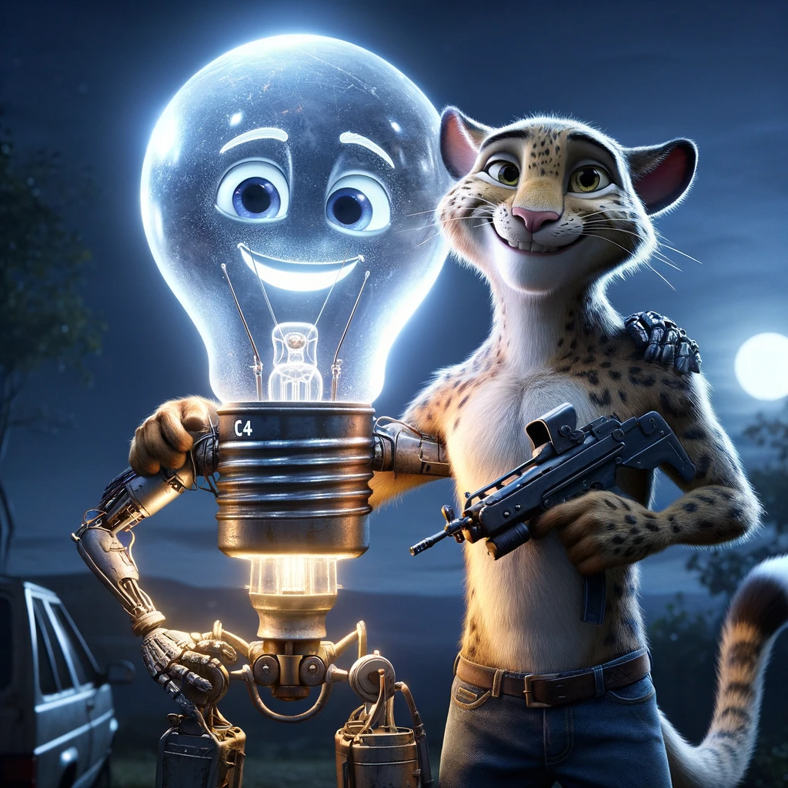

# IDEAS 💡

<details> <summary> Prompt Fighters 👽 </summary>

# PROMPT FIGHTERS❗

Do you remember when you were a kid and you were using your toys to create legendary fights?

Have you ever thought on betting real money on fair imagination battles with your friends? (its not fair to say my punch has infinity power + 1 so I defeat you)

Do you wanna let your imagination fight for you and possibly earn passive income while you are doing whatever other thing?

Well here we present... PROMPT BATTLE!

---

#### ***`Tech Used`***

- Chainlink VRF
- Chainlink CCIP
- Chainlink Functions
- Chainlink Upkeep
- Lens
- OpenAI - APIs
- PolygonID (maybe)

---

## What is it❓

Prompt Fighters is a game that allows you to create your own NFT that can be literally anything and then use it to fight against other players.

How is that possible? Using AI and blockchain techology we have managed to create real world imaginary battles that are fair and transparent.

---

## How does it work❓

---

### Create your character 🧑‍🤝‍🧑

You enter the website, you connect your wallet, you fill up the template prompt to create your character and badamboom!

An AI that generates images will make your character come true and save its description and image on blockchain.

As we are using _`Chainlink Functions`_ for that all the players have the same tempalte prompt and all characters will be balanced creating a fair metagame.

> **WARNING ⚠️**: If your NFT contains non-appropiate contect according to OpenAI filters you won't be able to generate it.

<details> <summary> Promt Template 📜 </summary>

```
CREATE A REALISTIC IMAGE OF A CHARACTER THAT:
Name: A_NAME
Race: WRITE_ANYTHING_YOU_CAN_IMAGINE
Weapon: WRITE_ANYTHING_YOU_CAN_IMAGINE
Special skill: WRITE_ANYTHING_YOU_CAN_IMAGINE
Fear: WRITE_ANYTHING_YOU_CAN_IMAGINE

FILTERS:

- If the character is too powerful do nothing and just return the word: INVALID. Too powerful means that he has things like infinite power. Things like in any of the descirptions having words that indicate traits that would make the characters always win in a story: my character always wins, he is invincible... Keep in mind that the characters have to be able to create interesting battle stories against other characters.

- The characters can be as wacky as they want to be, just say INVALID if the character has some words that describe it as unvincible which would ruin the fight experience for other players.
```

</details>

<details> <summary> C4: the magical light bulb that explodes 🔅</summary>

```
CREATE A REALISTIC IMAGE OF A CHARACTER THAT:
Name: C4
Race: An explosive in the shape of a magical ligth bulb
Weapon: A machinegun
Special skill: Explode, but he loses if he does, its just a last resource
Fear: Exploding

(Rest of the promt...)
```
</details>

<details> <summary> Leonardo: the 2 tails leopard that has a knife and plays golf really well 🐆</summary>

```
CREATE A REALISTIC IMAGE OF A CHARACTER THAT:
Name: Leonardo
Race: A leopard with 4 legs and 2 tails
Weapon: A knife
Special skill: Runs very fast and is very good at playing golf
Fear: Looking himself in the mirror

(Rest of the promt...)
```
</details>

<details> <summary> Leonardo and C4 after their fight</summary>

 

</details>

---

### FIGHT! 👊

You will decide to bet some money and when someone accepts your offer your characters will fight!

In the imagination world (chatGPT ivnents a story with a specific prompt) your NFTs will fight and after that you will receive a short story on how the fight went. (When AI generates better videos this could be a video)
(Again using Chainlink Functions for transparently using the same prompt when calling OpenAI-APIs)

The winner will be decided by statistics based on your nfts traits and your opponents ones, and using VRF a fair winner will be decided. You never know who will fight in the imagination realm! But sometimes if circumstances are favourable your character might have more chances! (This is how we use Chainlink VRF)

Example duel between Leonardo and C4:

```
Under the shimmering moon, C4, the magical light bulb with explosive tendencies, faced Leonardo, the swift leopard with two tails. C4's machine gun gleamed in the night as Leonardo brandished his knife, his four legs poised to sprint.

The air crackled with tension, the duelists’ eyes locked in a fierce stare. C4 calculated, knowing his greatest strength was his final move, while Leonardo flexed his tails, ready to dash. They circled, Leonardo's speed a blur, C4's barrel a steady hum.

Then, in a flash, Leonardo used his golf skills to chip a stone towards C4. It was a feint; as C4 braced for impact, Leonardo pounced from behind, pinning C4 without triggering an explosion. The bulb, fearing its end, surrendered.

WINNER == Leonardo.
```

---

### FAME AND GLORY! 🏆

Your NFTs will have a life on their own and social media profiles on Lens with their own history stats, number of fights won, reputation etc
(Lens)

---

### THE MARKET OF WARRIORS 🪖💸

As your fighters are NFT you can trade it as much as you want.

You can even lend your imaginative fighters (NFTs) to other plaers anad earn interest on the fight they win when other players use them.

---

### AUTOMATED GAMING 🎲🎮

Would you like to play with your imagination like your kid inside but you don't have time cause of adulthood???

DONT WORRY! You can leave a fighter in the ETHERNAL ARENA and let it automatically fight non-stop until you want so every night, when coming back from work, you can just enter the website and read the amazing battles your NFT has been battleing around while you were working.

For cheap ETHERNAL FIGHTING we use CCIP to load-off computing costs and Chainlink Upkeep to make it automated. 

</details>

<details> <summary> Perlucidus 📫 (Privacy Preserving Decentralized Institutional Voting) </summary>

Using Chainlink DECO to verify citizenship via official goverments or institutions APIs we can create a smart contract system where citizens register and vote in a zk-way just proving they are valid citizens.

Chainlink CCIP to couting votes chepaer.
Chainlink UpKeep to put a deadline on the elections time.

</details>
