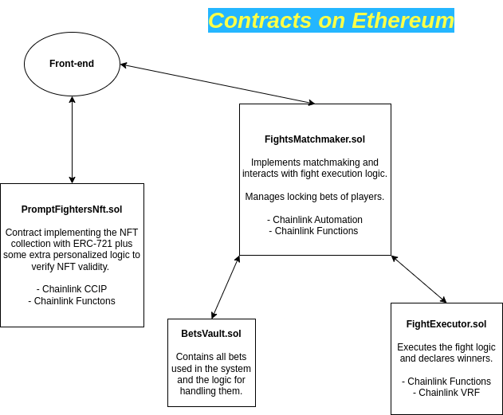
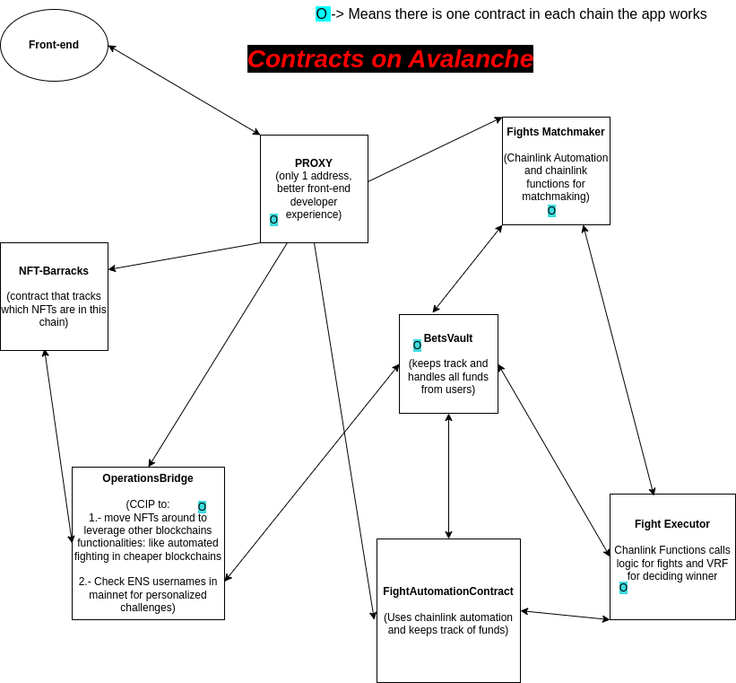

# ⚙️ Architecture Diagrams ⚙️

---

## Contracts on `Ethereum` (Sepolia)

 
 png 🖼️ 

---

---

### Contracts on `Avalanche` (Fuji)

#### (or any EVM compatible chain which doesn't have the main NFT collection)

 
 png 🖼️ 

## 

---

---

### Details 📝

On top of this ontracts we use:

- `TheGraph` to keep track of events and notify users.
- `ENS` for easily challenging friends addresses mapping them to human readable nicknames. ⚠️ NOT IMPLEMENTED, RUNNING OUT OF TIME ⚠️

We use `Ethereum` for storing our collection due to its higher decentralization and security. And we leverage `Avalanche` for its chepaer costs when automating game mechanics or in its simple execution. This dual-chain approach benefits players who prefer economical gameplay, while still having their fighter assets on a higher decentralization chain.

---

---
