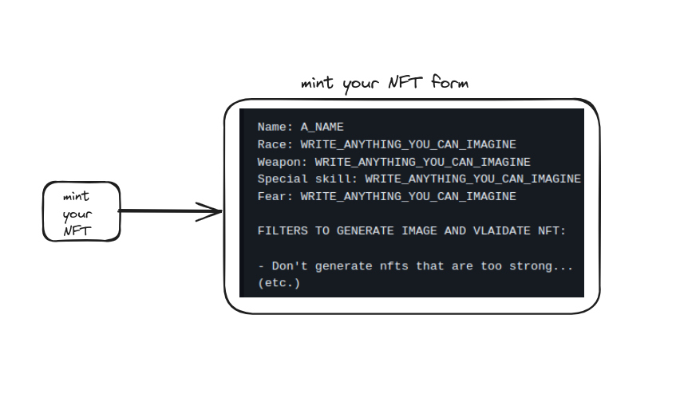
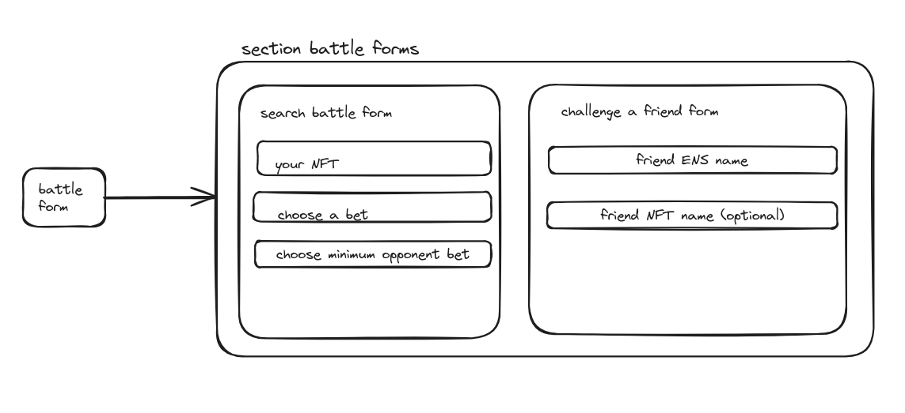
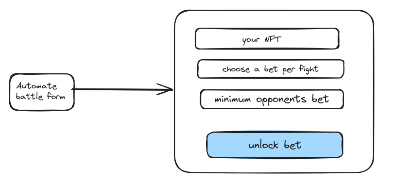

# UX - Workflow 🍷🌊🦭🌊

1️⃣ User enters the website and sees this.

 
 landing-page 🐒💻 

---

2️⃣ User connects wallet and sees all these components and features.

 
 main-page-wallet-connected 💸💻👛🦊 

---

3️⃣ User clicks on button mint your NFT.

 
 form-mint-your-NFT ✏️ 📃 

---

4️⃣ User clicks on button battle form.

 
 section-battle-forms ✏️ 📃🥊 

---

5️⃣ User clicks on button automate battle form.

 
 automate-battle-form 🤖🥊 

---

6️⃣ User enters a fight and this page shows.

 
 fight-page 👊💻 

