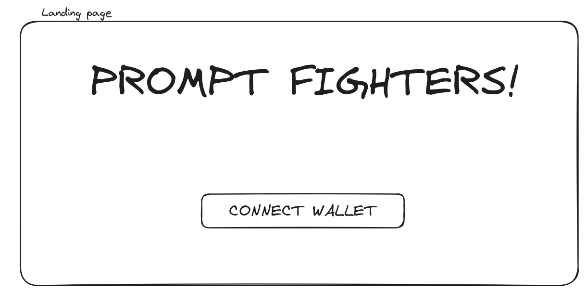
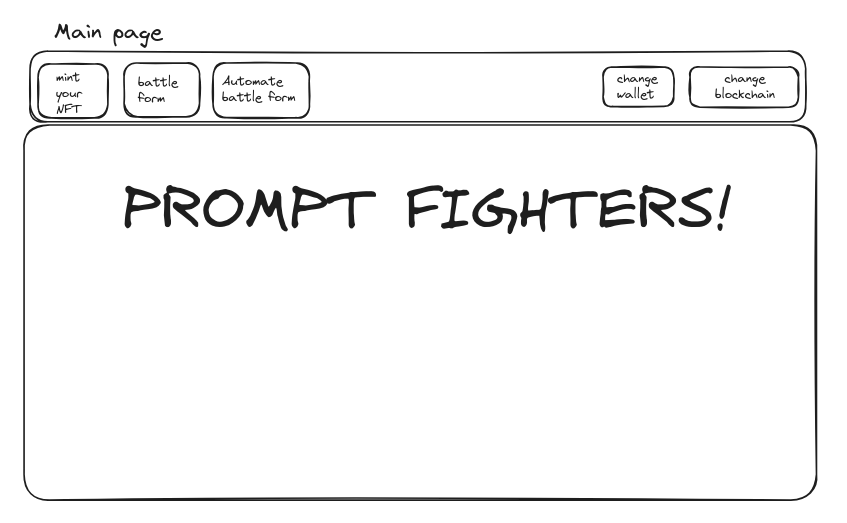
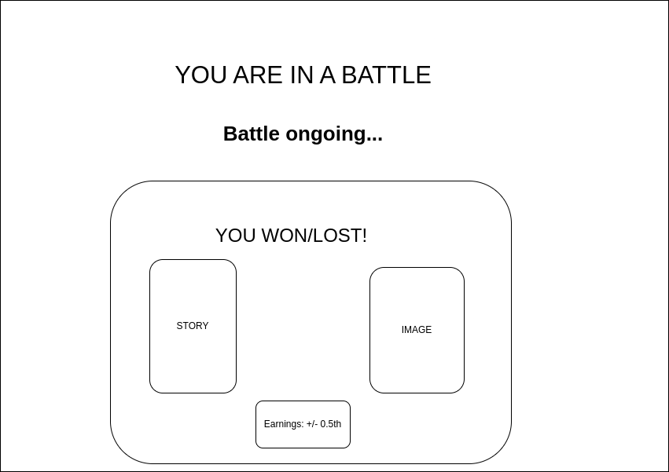

# UX - Workflow 🍷🌊🦭🌊

1️⃣ User enters the website and sees this.

 
 landing-page 🐒💻 

---

2️⃣ User connects wallet and sees all these components and features.

 
 main-page-wallet-connected 💸💻 

---

3️⃣ User enters a fight and this page shows.

 
 fight-page 👊💻 

