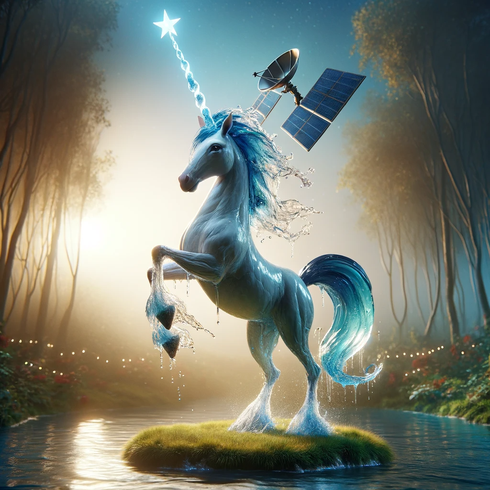
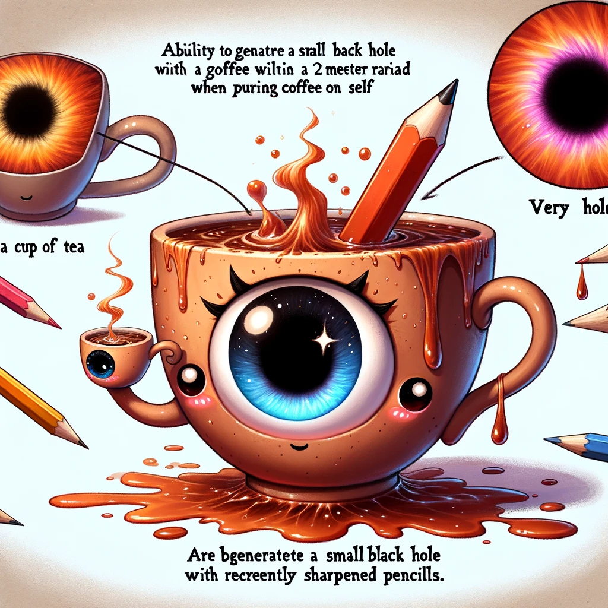
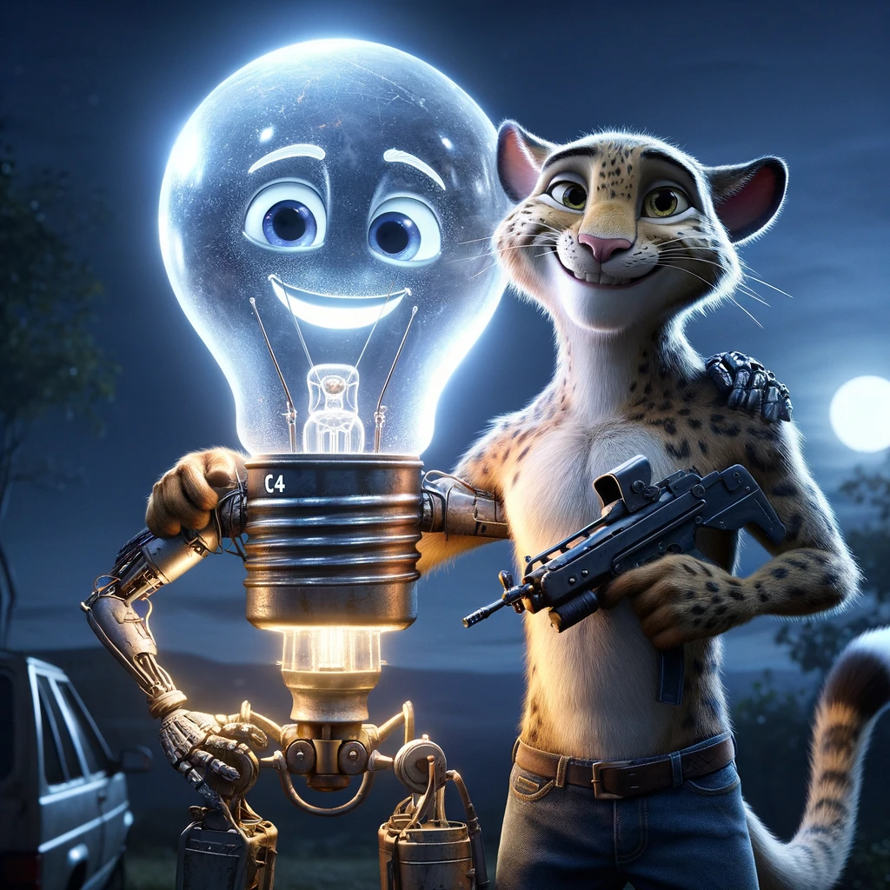

# 📜 PROMPT FIGHTERS WHITEPAPER 📜

## Introduciton 🍹

Prompt Fighters is a decentralized figthing game. It consists in creating your own unique character as an NFT using your imagination to challenge and bet money against other people's imagination.

You imagine your character and send a transaction to a smart contract which will transparently and trust minimized call an AI to generate an image representing your NFT. Once created you can use it to fight in AI generated fights against other players and bet money on the results.

But don't worry, the winner is decided by unbiased blockchain mechanics.

The aim of this project is to bring you back to your childhood when you imagined impossible fights with your friends where you could launch a infite power punch to your friend and he answered back with an infifite power +1 attack. But in a balanced, fair and interesting way thanks to blockchain technloogy and AI.

---

## Index 📓

- Introduciton.
- Personalized NFTs.
- Fight against other NFTs.
- Automated Fighting.
- Friends System.
- Future cool mechanics.

---

## Personalized NFTs 🐸🐴🐔🏊

The proccess of creating your NFT goes as follows.

Enter the website and then decide how to fill up the template prompt for generating your NFT which looks somethng like:

**TODO**: change for final prompt

```
Name: A_NAME
Race: WRITE_ANYTHING_YOU_CAN_IMAGINE
Weapon: WRITE_ANYTHING_YOU_CAN_IMAGINE
Special skill: WRITE_ANYTHING_YOU_CAN_IMAGINE
Fear: WRITE_ANYTHING_YOU_CAN_IMAGINE

FILTERS TO GENERATE IMAGE AND VLAIDATE NFT:

- Don't generate nfts that are too strong...
(etc.)
```

After filling up the prompt you will send a transaction to the blockchain that will mint your NFT with your brand new prompt after
passing a filter to safely check if the prompt is _**VALID**_.

Notice that if your prompt goes against any of the policies applied by the AI generation tool the image won't be generated and your NFT won't be registed in the smart contract.

So please before creating your NFT use a simulation tool (like writing yourself the prompt to the AI) to simulate your prompt and make sure part of your money is not wasted.

<details> <summary> Example of prompt filled: Fernando 🦄 </summary>

```
Name: Fernando
Race: A unicorn made out of water with 3 tails
Weapon: A satellite on the top of its corn
Special skill: He can scream so loud it makes you ponder about your own existance.
Fear: Apple juice

(Rest of the promt egineering filters...)
```

### Result (AI used `DALL.E`) 🎨



</details>

<details> <summary> Example of prompt filled: Ana ☕ </summary>

```
Name: Ana
Race: A cup of tea with baby eyes
Weapon: She holds another cup with very very hot coofe, the cup has a blackhole drawn on it
Special skill: When she pours cofe on herself she can generate a small blackhole anywhere in a radious of 2 meters.
Fear: Pencils that have been sharpened recently

(rest of the promt filters...)
```

### Result (AI used `DALL.E`) 🎨



</details>

<br/>

---

## Fight against other NFTs 💥👊😎

For this you will send a transaction which will notify other users that you are looking for a fight and the amount of money you are betting.

When another players sees your offer they can accept it and the fight will take place.

An AI will be prompted with the instructions to make your NFTs fight in an interesting battle (with a personalized generic promt as the one showed in NFT generation) and then it will provide 2 results, 1 where your NFT wins and other when the opponent's one wins.

Then on-chain, based on fair probability a winner will be chosen, the story on how the NFTs fought will be showed to the players and the bets will be distributed to the winner.

To read more about how the probabilities are decided check the technical details section.

Here is an example of a battle between Fernando and Ana.

### Story generated by `ChatGPT v4` 📖

```
In a mystical realm where oddities clash, Ana, the sentient cup of tea, faced Fernando, the water-formed unicorn. They stood in an arena, spectators watching with bated breath. Ana, gripping her cup of scalding coffee, glanced nervously at her opponent, recalling her fear of freshly sharpened pencils. Fernando, with a satellite adorning his horn, flicked his three tails, his fear of apple juice momentarily forgotten.

The duel began with Fernando emitting a reality-questioning roar, but Ana, surprisingly unfazed, countered by pouring coffee over herself. Suddenly, a small blackhole materialized near Fernando, pulling at his watery form. Fernando, struggling against the gravitational pull, unleashed a water jet towards Ana, but the blackhole absorbed it.

Ana, seizing the moment, advanced closer, the blackhole intensifying. Fernando, unable to maintain his form, began to dissipate, surrendering to the surprising might of the tea cup.

WINNER == Ana.
```

---

## Automated Fighting 💥👊🤖🤜💥

You can leave your NFT fighting so as to win rewards or just for reading the astonishng stories generated before you go to sleep after a long day of work.

For that you just have to send a transaction to the smart contract that sets your NFT in automation mode.

Chainlink Automation is used to automatically match you with other players NFTs while generating and executing fights.

---

## Challenge Your Friends 👪

You can challenge specific players and nfts instead of challengin anyone in the world.

For that we have a fornt-end option of registering your NFT to ENS and then easily track the address of someone you want to challenge.

---

## More Characters Examples 👽🐄💯

<details> <summary> C4: the magical light bulb that explodes 🔅</summary>

```
CREATE A REALISTIC IMAGE OF A CHARACTER THAT:
Name: C4
Race: An explosive in the shape of a magical ligth bulb
Weapon: A machinegun
Special skill: Explode, but he loses if he does, its just a last resource
Fear: Exploding

(Rest of the promt...)
```

</details>

<details> <summary> Leonardo: the 2 tails leopard that has a knife and plays golf really well 🐆</summary>

```
CREATE A REALISTIC IMAGE OF A CHARACTER THAT:
Name: Leonardo
Race: A leopard with 4 legs and 2 tails
Weapon: A knife
Special skill: Runs very fast and is very good at playing golf
Fear: Looking himself in the mirror

(Rest of the promt...)
```

</details>

<details> <summary> Leonardo and C4 after their fight</summary>



</details>

## Current Limitations of the implementaiton ⚙️🗻

> 📘 **Note** ℹ️: Due to the deadline we decided to simplify the general idea to a Proof Of Concept.

1. The current implementation doesn't generate any NFT iamges.
2. Only 5 people can have their NFT in automated mode.
3. Your NFTs can easily be copied by other players.
(**TODO:** revise if there are more)

## Future Ideas 🪄🔮

> 📘 **Note** ℹ️: We had more features in plan but due to the deadline we decided to leave them here as an interesting example on what else can be done with this kind of game.

### THE MARKET OF WARRIORS 🪖💸

As your fighters are NFT you can trade them as much as you want.

You can even lend your imaginative fighters (NFTs) to other players and earn interest on the fights they win when other players use them.

### Social Media Reputation of NFTs 🧑‍🤝‍🧑🫂

Create a wins and lose history and use it to create social media profiles for the fighters leveraging
Lens Protocol.
