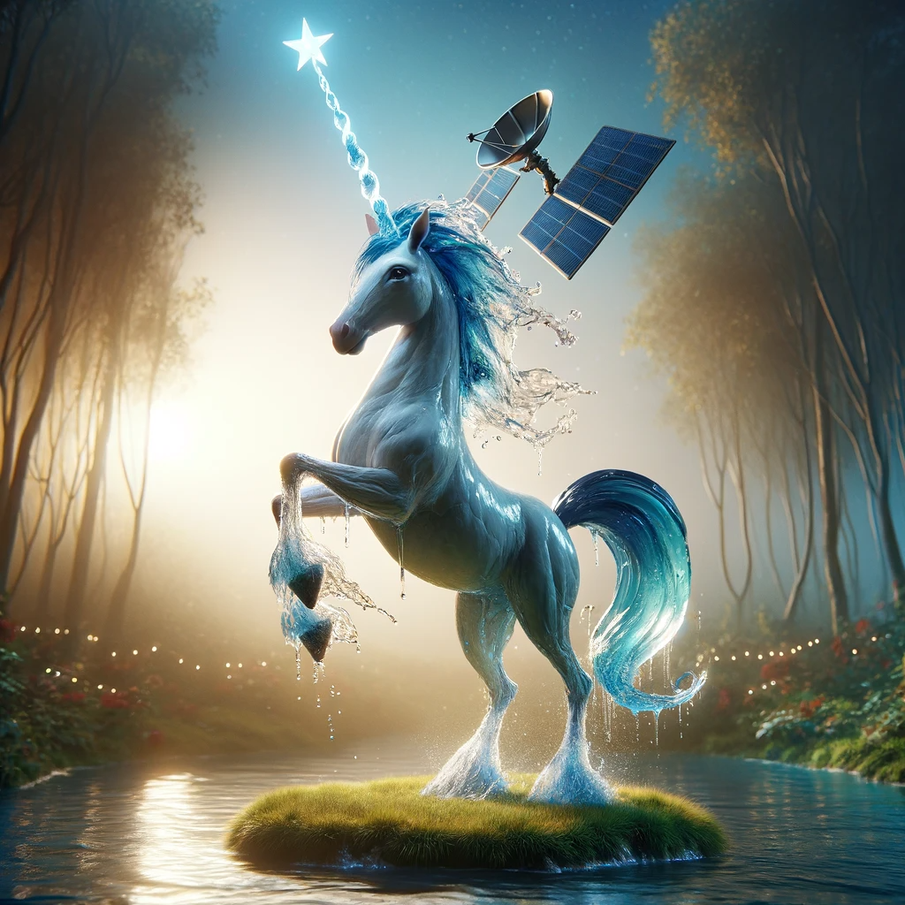
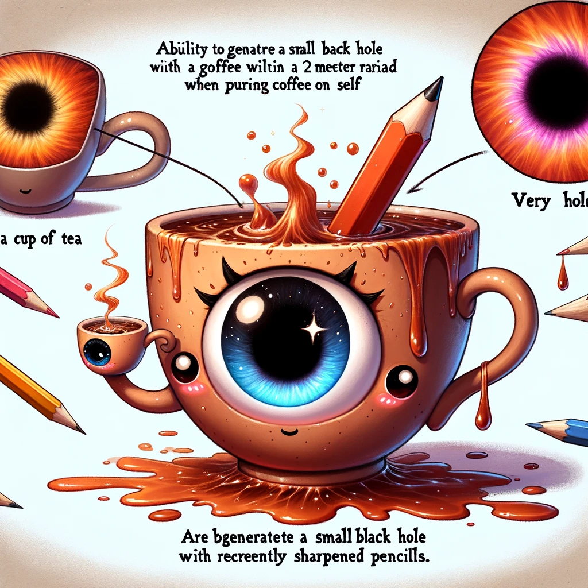

# 📜 PROMPT FIGHTERS WHITEPAPER 📜

## Introduciton 🍹

Prompt Fighters is a decentralized figthing game. It consists in creating your own character as an NFT using your imagination.

You imagine your character and send a transaction to a smart contract which will transparently and trust minimized call an AI to generate an image representing your NFT. Once created you can use it to fight in AI generated fights against other players and bet money on the results.

But don't worry, the winner is decided by unbiased blockchain mechanics.

The aim of this project is to bring you back to your childhood when you imagined impossible fights with your friends where you could launch a infite power punch to your friend and he answered back with an infifite power +1 attack. But in a balanced, fair and interesting way thanks to blockchain technloogy and AI.

---

## Index 📓

- Introduciton.
- Personalized NFTs.
- Fight against other NFTs.
- Automated Fighting.
- Social Media Reputation of NFTs.
- Lending&Borrowing of NFTs.
- Friends System.

---

## Personalized NFTs 🐸🐴🐔🏊

The proccess of creating your NFT goes as follows.

Enter the website and then decide how to fill up the template prompt for generating your NFT which looks somethng like:

```
CREATE A REALISTIC IMAGE OF A CHARACTER THAT:
Name: A_NAME
Race: WRITE_ANYTHING_YOU_CAN_IMAGINE
Weapon: WRITE_ANYTHING_YOU_CAN_IMAGINE
Special skill: WRITE_ANYTHING_YOU_CAN_IMAGINE
Fear: WRITE_ANYTHING_YOU_CAN_IMAGINE

FILTERS:

- If the character is too powerful do nothing and just return the word: INVALID. Too powerful means that he has things like infinite power.

(more prompt engineering so as to create a balanced metagame...)
```

<details> <summary> Example of prompt filled: Fernando 🦄 </summary>

```
CREATE A REALISTIC IMAGE OF A CHARACTER THAT:
Name: Fernando
Race: A unicorn made out of water with 3 tails
Weapon: A satellite on the top of its corn
Special skill: He can scream so loud it makes you ponder about your own existance.
Fear: Apple juice

(Rest of the promt egineering filters...)
```

### Result (AI used `DALL.E`) 🎨



</details>

<details> <summary> Example of prompt filled: Ana ☕ </summary>

```
CREATE A REALISTIC IMAGE OF A CHARACTER THAT:
Name: Ana
Race: A cup of tea with baby eyes
Weapon: She holds another cup with very very hot coofe, the cup has a blackhole drawn on it
Special skill: When she pours cofe on herself she can generate a small blackhole anywhere in a radious of 2 meters.
Fear: Pencils that have been sharpened recently

(rest of the promt filters...)
```

### Result (AI used `DALL.E`) 🎨



</details>

<br/>

Notice that if your prompt goes against any of the policies applied by the AI generation tool the image won't be generated and your NFT won't be registed in the smart contract.

So please before creating your NFT use the simulation tool to simulate your prompt and make sure your money is not wasted.

---

## Fight against other NFTs 💥👊😎

For this you will send a transaction that will notify other users that you are looking for a fight and the amount of money you are betting. (for now only ETH and its wrapped versions are supported)

When another players sees yout offer the can accept it and the fight will take place.

An AI will be prompted with the instructions to make your NFTs fight in an interesting battle (with a personalized generic promt as the one showed in NFT generation) and then it will provide 2 results, 1 where your NFT wins and other when the opponent's one wins.

Then on the blockchain, based on fair probability a winner will be chosen and the funds will be distributed. The story on how the NFTs fought will be saved on IPFS and a hash representing it will be stored on chain. After that the funds will be sent to the winner.

To see more about how the probabilities are decided check the technical docs paper.

Here is an example of a battle between Fernando and Ana.

### Story generated by `ChatGPT v4` 📖
```
In a mystical realm where oddities clash, Ana, the sentient cup of tea, faced Fernando, the water-formed unicorn. They stood in an arena, spectators watching with bated breath. Ana, gripping her cup of scalding coffee, glanced nervously at her opponent, recalling her fear of freshly sharpened pencils. Fernando, with a satellite adorning his horn, flicked his three tails, his fear of apple juice momentarily forgotten.

The duel began with Fernando emitting a reality-questioning roar, but Ana, surprisingly unfazed, countered by pouring coffee over herself. Suddenly, a small blackhole materialized near Fernando, pulling at his watery form. Fernando, struggling against the gravitational pull, unleashed a water jet towards Ana, but the blackhole absorbed it.

Ana, seizing the moment, advanced closer, the blackhole intensifying. Fernando, unable to maintain his form, began to dissipate, surrendering to the surprising might of the tea cup.

WINNER == Ana.
```

---

## Automated Fighting 💥👊🤖🤜💥 

You can leave your NFT fighting so as to wins rewards or for reading the astonishng stories generated before you go to sleep after a long day of work.

For that you just sent a transation to the smart contract that sets your NFT in automation mode.

Chainlink Automation is used to automatically match you with other players NFTs and generate and execute fights.

---

## Social Media Reputation of NFTs 🏆

Your NFTs will have a profile (or a place on your LENS profile) on LENS.

There you can check its reputation, wins, loses etc.

---

## Friends System 👪

Register your profile on ENS to be able to match in a easy way with your friends wallets and NFTs and challenge your chatacters to each other.

---


## Fighters Market 🪖

You can lend and borrow NFTs and get a percentage of the earnings another player got while using your NFT.

---


